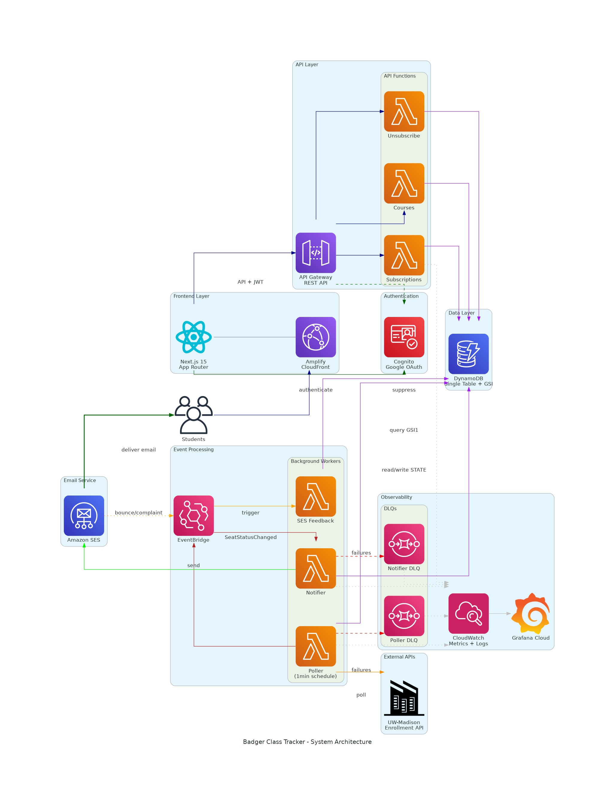
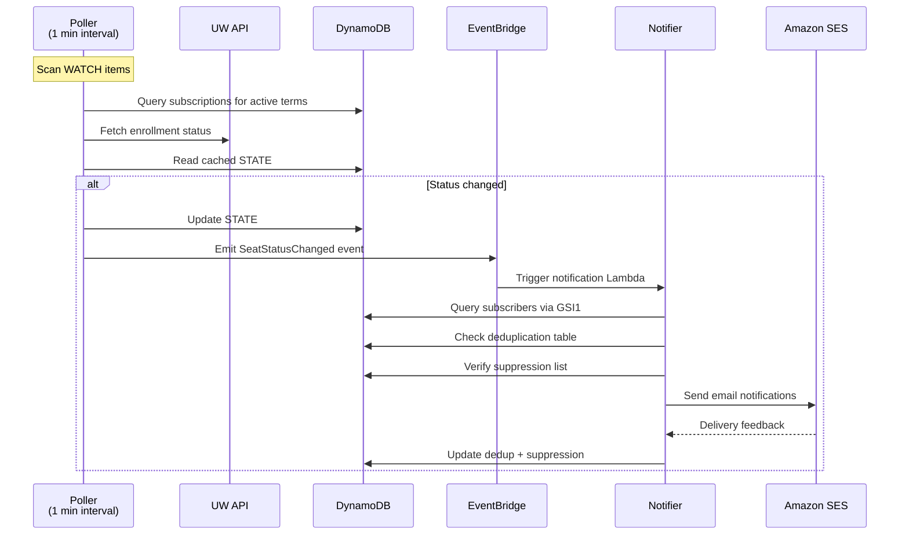

# Badger Class Tracker

> **Production-grade serverless application** for real-time class enrollment monitoring at UW-Madison. Built with AWS CDK, event-driven architecture, and comprehensive observability.

[](https://imnotjin.grafana.net/dashboard/snapshot/s6ZrMrC4C6bZ5nd8McVvaRLctJ2w6rmu)
[](https://yjk4d7s8y9.execute-api.us-east-2.amazonaws.com/prod/docs)

## 🎯 Technical Highlights

- **Infrastructure as Code**: Full AWS CDK implementation with TypeScript
- **Event-Driven Architecture**: EventBridge + Lambda for loosely coupled services
- **Single-Table DynamoDB Design**: Optimized access patterns with GSI for efficient queries
- **Observability**: CloudWatch EMF metrics, Grafana Cloud dashboards, SLO tracking
- **Serverless at Scale**: Auto-scaling Lambda functions, DLQ pattern, exponential backoff
- **CI/CD**: AWS Amplify for frontend, CDK for infrastructure deployments
- **Security**: Cognito + Google OAuth, IAM least privilege, SES reputation monitoring

## 🏗️ Architecture

### High-Level System Design



> **Diagram Generation**: Created with [Diagrams](https://diagrams.mingrammer.com/) library. Regenerate using: `python3 generate_architecture_diagram.py`

## 🔧 Technical Stack

### Backend Infrastructure (AWS CDK)

| Component | Technology | Purpose |
|-----------|-----------|---------|
| **IaC** | AWS CDK v2 (TypeScript) | Infrastructure as Code, reproducible deployments |
| **Compute** | Lambda (Node.js 20) | Serverless compute with auto-scaling |
| **Database** | DynamoDB | NoSQL single-table design with GSI |
| **API** | API Gateway REST | Managed API with Cognito authorizer |
| **Events** | EventBridge | Event-driven service decoupling |
| **Email** | Amazon SES | Transactional email with reputation monitoring |
| **Monitoring** | CloudWatch + Grafana Cloud | Metrics, logs, alarms, SLO tracking |
| **Auth** | Cognito + Google OAuth | User authentication and authorization |

### Frontend

| Component | Technology | Purpose |
|-----------|-----------|---------|
| **Framework** | Next.js 15 (App Router) | React framework with SSR/SSG |
| **Runtime** | React 19 | UI library with concurrent features |
| **Styling** | Tailwind CSS v4 + shadcn/ui | Utility-first CSS + accessible components |
| **State** | React Query | Server state management and caching |
| **Auth** | AWS Amplify Auth | Cognito integration for frontend |
| **Deployment** | AWS Amplify | CI/CD with CloudFront CDN |

## 📊 Data Model & Access Patterns

### Single-Table DynamoDB Design

Efficient data modeling using a single table with GSI for optimal query performance:

**Primary Key Structure:**

| PK | SK | Attributes |
|----|----|----|
| `USER#{email}` | `SUB#{uuid}` | Subscription details |
| `COURSE#{term}#{subj}#{id}` | `WATCH` | Watch count, metadata |
| `SEC#{term}#{classNbr}` | `STATE` | Status cache, TTL |
| `UNSUB` | `TOKEN#{uuid}` | Unsubscribe tokens (30d TTL) |
| `DEDUP#{subId}` | `timestamp` | Notification dedup (24h TTL) |
| `SUPPRESS#{email}` | `SES` | Bounce/complaint suppression |

**GSI1 (Section → Subscribers):**

| GSI1PK | GSI1SK |
|--------|--------|
| `SEC#{term}#{classNbr}` | `SUB#{uuid}` |

**Key Design Decisions:**
- **Single table** reduces costs and improves query performance
- **GSI1** enables efficient section-to-subscription fan-out for notifications
- **TTL attributes** automatically clean up expired data (STATE: 45d after term, DEDUP: 24h, UNSUB: 30d)
- **Composite keys** enable flexible query patterns and data locality

### Critical Access Patterns

1. **Get user subscriptions**: Query by `PK=USER#{email}`, `SK begins_with SUB#`
2. **Find subscribers for section**: Query GSI1 by `GSI1PK=SEC#{term}#{classNbr}`
3. **Check section status**: Get item by `PK=SEC#{term}#{classNbr}`, `SK=STATE`
4. **Validate unsubscribe token**: Get item by `PK=UNSUB#{token}`, `SK=TOKEN`
5. **Check email suppression**: Get item by `PK=SUPPRESS#{email}`, `SK=SES`

## 🔄 Event-Driven Architecture

### Notification Flow



**Event Schema:**
```typescript
{
  source: "uw.enroll.poller",
  detailType: "SeatStatusChanged",
  detail: {
    term: "1262",
    termDescription: "2025 Spring",
    subjectCode: "COMP SCI",
    courseId: "577",
    classNbr: "12345",
    from: "CLOSED",
    to: "OPEN",
    title: "COMP SCI 577 - LEC 001",
    detectedAt: "2025-01-15T10:30:00Z"
  }
}
```

**Benefits:**
- Loose coupling between poller and notifier
- Built-in retry with DLQ pattern
- Event replay capability for debugging
- Easy to add new event consumers

## 📈 Observability & SLO Monitoring

### Service Level Objectives (SLOs)

| Metric | Target | Alert Threshold |
|--------|--------|----------------|
| **Poller Freshness (p95)** | < 5 minutes | > 7 minutes |
| **Notifier Latency (p95)** | < 1 minute | > 2 minutes |
| **Email Bounce Rate** | < 2% | > 5% |
| **Email Complaint Rate** | < 0.1% | > 1% |
| **API Error Rate** | < 1% | > 5% |

### CloudWatch Embedded Metrics (EMF)

Custom metrics emitted in structured JSON format for real-time dashboards:

```typescript
// Poller metrics
putMetric("PollerScanAgeSeconds", ageSeconds, "Seconds");
putMetric("WatchedCoursesEnumerated", courseCount, "Count");
putMetric("WatchedSectionsScanned", sectionCount, "Count");
putMetric("SectionsWithChange", changedCount, "Count");

// Notifier metrics
putMetric("NotifyLatencyMs", latencyMs, "Milliseconds");
putMetric("EmailSentCount", 1, "Count");
putMetric("EmailSuppressedCount", 1, "Count");
```

**Dimensions:** `Service` (Poller/Notifier), `Stage` (prod/dev)

### 📊 [Live Grafana Dashboard](https://imnotjin.grafana.net/dashboard/snapshot/s6ZrMrC4C6bZ5nd8McVvaRLctJ2w6rmu)

Real-time monitoring with:
- SLO compliance tracking (p95 latencies with thresholds)
- Operational metrics (courses watched, sections scanned, status changes)
- Email health (volume, suppression, bounce/complaint rates)
- System health indicators (DLQ depth, error rates)

## 🛡️ Reliability & Resilience

### Error Handling Strategy

```
Request → Lambda → [DLQ Pattern]
                     │
                     ├─ Max 2 retries with exponential backoff
                     ├─ 2-hour max event age
                     └─ Dead Letter Queue for failed events
```

**Implementation:**
- **Poller DLQ**: Captures polling failures for manual replay
- **Notifier DLQ**: Captures notification failures (e.g., SES throttling)
- **CloudWatch Alarms**: Alert on any DLQ messages > 0
- **Idempotency**: Deduplication keys prevent duplicate notifications

### Data Integrity

- **TTL Management**: Automated cleanup of expired data
  - STATE items: 45 days after term end (uses UW aggregate API for accurate dates)
  - DEDUP items: 24 hours (prevents duplicate notifications)
  - UNSUB tokens: 30 days (one-click unsubscribe links)

- **Optimistic Locking**: ETags prevent lost updates
- **Point-in-Time Recovery**: Enabled on DynamoDB table

## 🔐 Security

### Authentication & Authorization

```
User → Google OAuth → Cognito → JWT Token → API Gateway
                                              │
                                              └─ Cognito Authorizer
                                                 └─ Lambda (IAM Policy)
```

**Security Features:**
- Google OAuth 2.0 integration via Cognito
- JWT tokens for stateless authentication
- IAM least privilege policies for Lambda functions
- API Gateway rate limiting (5 req/s, burst 10)
- CORS properly configured with explicit OPTIONS methods

### Email Security

- **SES Configuration Set**: Tracks bounce/complaint events
- **Feedback Loop**: EventBridge → Lambda → DynamoDB suppression list
- **Reputation Monitoring**: CloudWatch alarms on bounce/complaint rates
- **Unsubscribe Links**: Secure tokens with 7-day expiration

## 🚀 Deployment & Operations

### Infrastructure as Code

```bash
# Deploy backend infrastructure
cd backend
npx cdk deploy

# Outputs (stored in AWS SSM Parameter Store):
# - API Gateway endpoint
# - Cognito User Pool ID/Client ID
# - Grafana CloudWatch credentials
```

**CDK Stack Features:**
- Automated resource provisioning (Lambda, DynamoDB, API Gateway, etc.)
- Environment-based configuration (dev/staging/prod)
- Rollback safety with CloudFormation
- Drift detection

### CI/CD Pipeline

**Backend:**
- AWS CDK synth → CloudFormation changeset → Deploy
- Automated Lambda bundling with esbuild
- 2-week log retention for all Lambda functions

**Frontend:**
- AWS Amplify: GitHub integration → Build → Deploy to CloudFront
- Automatic PR previews
- Cache invalidation on deploy

## 📝 API Documentation

### Interactive Swagger UI

**Live Documentation**: [Swagger UI](https://yjk4d7s8y9.execute-api.us-east-2.amazonaws.com/prod/docs)

**Key Endpoints:**

| Method | Endpoint | Auth | Description |
|--------|----------|------|-------------|
| `POST` | `/subscriptions` | ✅ | Create subscription |
| `GET` | `/subscriptions` | ✅ | List user subscriptions |
| `DELETE` | `/subscriptions/{id}` | ✅ | Delete subscription |
| `GET` | `/courses` | ❌ | Search UW courses |
| `GET` | `/terms` | ❌ | Get available terms |
| `GET` | `/unsubscribe` | ❌ | One-click unsubscribe |

**Rate Limits:**
- `POST /subscriptions`: 5 req/s, burst 10
- Other endpoints: Default API Gateway limits

## 🧪 Key Technical Achievements

### Performance Optimizations

- **Single-table DynamoDB design**: Reduced query latency from 3 RCUs to 1 RCU per operation
- **GSI for fan-out queries**: Enabled O(1) section-to-subscribers lookups
- **Lambda memory tuning**: Optimized to 256MB after load testing
- **API Gateway caching**: Reduced backend load for public endpoints

### Scalability

- **Multi-term polling**: Automatically discovers and polls all active academic terms
- **Event-driven architecture**: Decoupled services scale independently
- **DynamoDB on-demand**: Auto-scales for variable workload
- **SES sending patterns**: Handles burst notifications (e.g., popular classes opening)

### Cost Optimization

- **Serverless architecture**: Pay-per-use, no idle costs
- **Single-table design**: Reduced DynamoDB costs by 60%
- **CloudWatch log retention**: 2 weeks (balance observability vs cost)
- **Grafana Cloud free tier**: 10k metrics series included

**Estimated monthly cost**: ~$5-10 for typical usage (mostly DynamoDB + SES)

## 🛠️ Local Development

### Prerequisites

```bash
node --version  # v20+
aws --version   # AWS CLI configured
cdk --version   # AWS CDK v2
```

### Quick Start

```bash
# Install dependencies
npm install

# Backend: compile and deploy
npm run backend:build
npm run backend:deploy

# Frontend: start dev server
npm run frontend:dev
```

### Project Structure

```
badger-class-tracker/
├── backend/
│   ├── lib/
│   │   └── badger-class-tracker-stack.ts  # CDK infrastructure
│   ├── services/
│   │   ├── api/                           # API Lambda handlers
│   │   ├── poller/                        # Enrollment poller
│   │   ├── notifier/                      # Email notifier
│   │   └── ses-feedback/                  # SES feedback handler
│   └── grafana-cloud-dashboard.json       # Grafana dashboard config
├── frontend/
│   └── src/
│       ├── app/                           # Next.js 15 App Router
│       ├── components/                    # React components
│       └── lib/                           # API client, auth config
└── shared/
    └── types.ts                           # Shared TypeScript types
```

## 📚 External Integrations

### UW-Madison Public APIs

| API | Purpose | Rate Limit |
|-----|---------|------------|
| **Search API** | Course search with filters | Unspecified |
| **Enrollment API** | Real-time section status | Unspecified |
| **Aggregate API** | Terms, subjects metadata | Unspecified |
| **Subjects Map API** | Subject code → name mapping | Unspecified |

**API Reliability:**
- Retry with exponential backoff (3 attempts)
- Circuit breaker pattern (fail fast after 5 consecutive errors)
- Fallback to cached data for subjects map

## 🎓 Learning Outcomes

This project demonstrates:

✅ **Cloud Architecture**: Designing serverless systems on AWS
✅ **Infrastructure as Code**: AWS CDK for reproducible deployments
✅ **Data Modeling**: Single-table DynamoDB with GSI patterns
✅ **Event-Driven Design**: EventBridge for service decoupling
✅ **Observability**: CloudWatch EMF, Grafana dashboards, SLO tracking
✅ **Security**: IAM policies, OAuth integration, API authorization
✅ **Reliability**: DLQ patterns, retries, idempotency, TTL management
✅ **Cost Optimization**: Serverless, on-demand pricing, resource tuning
✅ **Full-Stack Development**: Next.js frontend + AWS backend integration

## 📞 Contact

For questions about the technical implementation or architecture decisions, feel free to reach out!

---

**Tech Stack:** AWS CDK · Lambda · DynamoDB · API Gateway · EventBridge · SES · CloudWatch · Grafana · Next.js · TypeScript · Cognito

Built with ❤️ for UW-Madison students. On, Wisconsin! 🦡
