# Badger Class Tracker

A serverless web application that helps UW-Madison students get notified when seats open up in their desired courses. Built with Next.js, AWS CDK, and real-time enrollment monitoring.

## 🚀 Features

- **Real-time Class Monitoring**: Continuously tracks seat availability across all UW-Madison courses
- **Instant Email Notifications**: Get notified within seconds when seats become available
- **Smart Course Search**: Find courses by subject, catalog number, or keywords
- **Subscription Management**: Easy subscribe/unsubscribe with personalized dashboard
- **Google OAuth Integration**: Secure sign-in with your Google account
- **Mobile Responsive**: Works seamlessly on desktop and mobile devices
- **Multi-term Support**: Automatically tracks courses across different academic terms

## 🏗️ Architecture

This application uses a serverless architecture built on AWS:

### System Overview

```mermaid
graph TB
    User[👤 User] --> Frontend[🌐 NextJS App]
    Frontend --> Cognito[🔐 AWS Cognito]
    Frontend --> API[🔌 API Gateway]

    API --> Lambda1[λ API Functions]
    Lambda1 --> DDB[(🗄️ DynamoDB)]

    Poller[λ Background Functions] --> UW[🏫 UW Enrollment API]
    Poller --> DDB
    Poller --> EventBridge[📡 EventBridge]

    EventBridge --> SES[📮 Amazon SES]
    SES --> EmailUser[📬 User Email]

    CloudWatch[📊 CloudWatch] --> Lambda1
    CloudWatch --> Poller

    classDef aws fill:#FF9900,stroke:#232F3E,stroke-width:2px,color:white
    classDef user fill:#4CAF50,stroke:#2E7D32,stroke-width:2px,color:white
    classDef external fill:#2196F3,stroke:#1565C0,stroke-width:2px,color:white

    class User,EmailUser user
    class UW external
    class Cognito,API,DDB,EventBridge,SES,CloudWatch,Lambda1,Poller aws
```



### Frontend

- **Next.js 15** with App Router and Turbopack
- **React 19** with TypeScript for type safety
- **Tailwind CSS v4** with shadcn/ui components for modern UI
- **AWS Amplify Auth** for authentication with Cognito
- **React Query** for efficient API state management

### Backend (AWS CDK)

- **DynamoDB** single-table design with GSI for efficient queries
- **Lambda Functions** (Node.js 20) for API and background processing
- **API Gateway** with Cognito authorizer for secure endpoints
- **EventBridge** for event-driven notifications
- **SES** for reliable email delivery
- **CloudWatch** for monitoring and alerting

### Notification Flow

```mermaid
sequenceDiagram
    participant U as User
    participant F as Frontend
    participant A as API Gateway
    participant D as DynamoDB
    participant P as Poller
    participant UW as UW API
    participant E as EventBridge
    participant N as Notifier
    participant S as SES

    U->>F: Subscribe to course
    F->>A: POST /subscriptions
    A->>D: Store subscription

    Note over P: Every 1 minute
    P->>D: Query active subscriptions
    P->>UW: Check enrollment status
    P->>D: Update section state

    alt Seat becomes available
        P->>E: Emit SeatStatusChanged event
        E->>N: Trigger notification
        N->>D: Query subscribers
        N->>S: Send email notifications
        S->>U: 📧 Seat available!
    end
```



## 📊 Database Schema

Single DynamoDB table (`AppTable2`) with the following item types:

| Item Type | Primary Key (PK) | Sort Key (SK) | Key Attributes |
|-----------|------------------|---------------|----------------|
| **USER_SUBSCRIPTION** | `USER#{email}` | `SUB#{uuid}` | `subId`, `termCode`, `subjectCode`, `courseId`, `classNumber`, `active` |
| **COURSE_WATCH** | `COURSE#{term}#{subject}#{courseId}` | `WATCH` | `subCount`, `createdAt`, `updatedAt` |
| **SECTION_STATE** | `SEC#{term}#{classNbr}` | `STATE` | `status` (OPEN/CLOSED/WAITLISTED), `scannedAt`, `ttl` |
| **UNSUBSCRIBE_TOKEN** | `UNSUB` | `TOKEN#{uuid}` | `subId`, `userId`, `ttl` (30 days) |
| **EMAIL_DEDUP** | `DEDUP#{subId}` | `timestamp` | `ttl` (24 hours) |

**Global Secondary Index (GSI1):**
- **GSI1PK**: `SEC#{term}#{classNbr}`
- **GSI1SK**: `SUB#{uuid}`
- **Purpose**: Enables efficient section-to-subscription lookups

### Key Patterns

- **SUB**: User subscriptions (`PK=USER#{email}`, `SK=SUB#{uuid}`)
- **WATCH**: Course registry (`PK=COURSE#{term}#{subject}#{courseId}`, `SK=WATCH`)
- **STATE**: Section status cache (`PK=SEC#{term}#{classNbr}`, `SK=STATE`)
- **UNSUB**: Unsubscribe tokens with TTL
- **DEDUP**: Duplicate prevention for notifications

**GSI1** enables efficient section-to-subscription lookups:

- `GSI1PK=SEC#{term}#{classNbr}` → `GSI1SK=SUB#{uuid}`

### Deployment Architecture

```mermaid
graph TB
    subgraph "Development Environment"
        Developer[👨‍💻 Developer]
        GitHub[📂 GitHub Repository]
        CDK[⚙️ AWS CDK]
    end

    subgraph "AWS Cloud"
        subgraph "Frontend Infrastructure"
            Amplify[🚀 AWS Amplify]
            CloudFront[🌐 CloudFront CDN]
        end

        subgraph "Authentication"
            Cognito[🔐 Cognito User Pool]
            OAuth[🔑 Google OAuth]
        end

        subgraph "API Layer"
            APIGateway[🔌 API Gateway]
        end

        subgraph "Compute Layer"
            LambdaAPI[λ API Functions]
            LambdaPoller[λ Enrollment Poller]
            LambdaNotifier[λ Email Notifier]
        end

        subgraph "Data Layer"
            DynamoDB[(🗄️ DynamoDB)]
            SES[📮 Amazon SES]
        end

        subgraph "Event & Monitoring"
            EventBridge[📡 EventBridge]
            CloudWatch[📊 CloudWatch]
            SNS[📢 SNS Alerts]
        end
    end

    subgraph "External Services"
        UWAPI[🏫 UW Enrollment API]
        UserEmail[📧 User Email]
    end

    %% Development Flow
    Developer -.->|push| GitHub
    Developer -.->|deploy| CDK
    GitHub -.->|build| Amplify

    %% Infrastructure Deployment
    CDK ==>|provision| APIGateway
    CDK ==>|provision| LambdaAPI
    CDK ==>|provision| LambdaPoller
    CDK ==>|provision| LambdaNotifier
    CDK ==>|provision| DynamoDB
    CDK ==>|provision| CloudWatch
    CDK ==>|provision| EventBridge
    CDK ==>|provision| SES

    %% Frontend Flow
    Amplify -->|deploy| CloudFront
    CloudFront -->|auth| Cognito
    Cognito -->|oauth| OAuth
    Cognito -->|authorize| APIGateway

    %% API Flow
    APIGateway -->|invoke| LambdaAPI
    LambdaAPI -->|store| DynamoDB

    %% Background Processing Flow
    LambdaPoller -->|fetch| UWAPI
    LambdaPoller -->|read/write| DynamoDB
    LambdaPoller -->|emit| EventBridge

    %% Notification Flow
    EventBridge -->|trigger| LambdaNotifier
    LambdaNotifier -->|send| SES
    LambdaNotifier -->|query| DynamoDB
    SES -->|deliver| UserEmail

    %% Monitoring Flow
    CloudWatch -.->|monitor| LambdaPoller
    CloudWatch -.->|monitor| LambdaNotifier
    CloudWatch -.->|monitor| APIGateway
    CloudWatch -.->|alert| SNS

    classDef aws fill:#FF9900,stroke:#232F3E,stroke-width:2px,color:white
    classDef dev fill:#4CAF50,stroke:#2E7D32,stroke-width:2px,color:white
    classDef external fill:#2196F3,stroke:#1565C0,stroke-width:2px,color:white

    class Developer,GitHub,CDK dev
    class UWAPI,UserEmail external
    class Amplify,CloudFront,Cognito,OAuth,APIGateway,LambdaAPI,LambdaPoller,LambdaNotifier,DynamoDB,SES,EventBridge,CloudWatch,SNS aws
```



## 🛠️ Setup & Development

### Prerequisites

- Node.js 20+ and npm 10+
- AWS CLI configured with appropriate permissions
- AWS CDK v2 installed globally: `npm install -g aws-cdk`

### Environment Setup

1. **Clone and install dependencies:**

   ```bash
   git clone <repository-url>
   cd badger-class-tracker
   npm install
   ```

2. **Backend configuration:**

   ```bash
   cd backend
   cp .env.example .env
   # Add your Google OAuth credentials to .env
   ```

3. **Frontend configuration:**
   ```bash
   cd frontend
   cp .env.local.example .env.local
   # Configure Cognito and API endpoints
   ```

### Development Commands

**Root level (monorepo):**

```bash
npm run build          # Build both backend and frontend
npm run dev            # Run both in development mode
npm run clean          # Clean all node_modules and build outputs
```

**Backend specific:**

```bash
npm run backend:build  # Compile TypeScript
npm run backend:deploy # Deploy CDK stack to AWS
npm run backend:dev    # Watch mode for development
```

**Frontend specific:**

```bash
npm run frontend:build # Build for production
npm run frontend:dev   # Development server
npm run frontend:start # Production server
```

## 🚀 Deployment

### Initial Deployment

1. **Configure AWS credentials:**

   ```bash
   aws configure
   ```

2. **Bootstrap CDK (first time only):**

   ```bash
   cd backend
   npx cdk bootstrap
   ```

3. **Deploy backend infrastructure:**

   ```bash
   npx cdk deploy
   ```

4. **Deploy frontend to AWS Amplify:**
   - Connect your GitHub repository to AWS Amplify
   - Configure build settings using the provided `amplify.yml`
   - Set environment variables for Cognito configuration

### Environment Variables

**Backend (.env):**

```
GOOGLE_CLIENT_ID=your_google_client_id
GOOGLE_CLIENT_SECRET=your_google_client_secret
```

**Frontend (.env.local):**

```
NEXT_PUBLIC_API_URL=your_api_gateway_url
NEXT_PUBLIC_USER_POOL_ID=your_cognito_user_pool_id
NEXT_PUBLIC_USER_POOL_CLIENT_ID=your_cognito_client_id
NEXT_PUBLIC_REGION=your_cognito_region
```

## 📝 API Documentation

### Interactive Documentation

Full API documentation is available via Swagger UI:

- **Swagger UI**: `https://yjk4d7s8y9.execute-api.us-east-2.amazonaws.com/prod/docs`
- **OpenAPI Spec**: `https://yjk4d7s8y9.execute-api.us-east-2.amazonaws.com/prod/docs/swagger.json`

The interactive documentation includes:

- Complete endpoint specifications with request/response schemas
- Authentication requirements and examples
- Try-it-out functionality for testing endpoints
- Detailed parameter descriptions and validation rules

### Quick Reference

**Protected Endpoints** (require JWT Bearer token):

- `GET /subscriptions` - List user's subscriptions
- `POST /subscriptions` - Create new subscription
- `DELETE /subscriptions/{id}` - Delete subscription

**Public Endpoints**:

- `GET /courses` - Search UW courses
- `GET /terms` - Get available academic terms
- `GET /unsubscribe` - Unsubscribe via email link

### Authentication

Protected endpoints require JWT Bearer token from Cognito:

```
Authorization: Bearer <jwt_token>
```

## 🔄 External APIs

### UW-Madison Public APIs

- **Search API**: `https://public.enroll.wisc.edu/api/search/v1`
- **Enrollment API**: `https://public.enroll.wisc.edu/api/search/v1/enrollmentPackages/{term}/{subject}/{courseId}`
- **Aggregate API**: `https://public.enroll.wisc.edu/api/search/v1/aggregate`
- **Subjects Map API**: `https://public.enroll.wisc.edu/api/search/v1/subjectsMap`

## 🧪 Testing

```bash
# Backend tests
cd backend
npm test

# Frontend tests (when available)
cd frontend
npm test
```

## 📱 Usage

1. **Sign in** with your Google account
2. **Search** for courses using the search page
3. **Subscribe** to sections you want to monitor
4. **Manage** your subscriptions from the dashboard
5. **Receive** email notifications when seats open up

## 🚨 Troubleshooting

### Common Issues

**Build failures:**

- Ensure Node.js 20+ is installed
- Clear node_modules and reinstall: `npm run clean && npm install`

**Authentication issues:**

- Verify Cognito configuration in environment variables
- Check AWS Amplify Auth setup

**Email notifications not working:**

- Verify SES configuration and domain verification
- Check CloudWatch logs for Lambda errors

**Development server issues:**

- Ensure all environment variables are set
- Check for port conflicts (default: 3000)

### Logs and Monitoring

- **CloudWatch Logs**: Monitor Lambda function execution
- **CloudWatch Metrics**: Track API performance and errors
- **SES Dashboard**: Monitor email delivery and bounces

## 🤝 Contributing

1. Fork the repository
2. Create a feature branch: `git checkout -b feature/your-feature`
3. Make your changes following the existing code style
4. Test your changes thoroughly
5. Commit with conventional commit format: `type(scope): description`
6. Push and create a pull request

### Commit Guidelines

- Follow [Conventional Commits](https://www.conventionalcommits.org/) format
- Examples: `feat(backend): add new API endpoint`, `fix(frontend): resolve auth issue`
- Group related changes into logical commits

## 📄 License

This project is private and intended for UW-Madison students.

## 📞 Support

For issues or questions:

- Check the troubleshooting section above
- Review CloudWatch logs for error details
- Open an issue in the repository

---

Built with ❤️ for UW-Madison students. On, Wisconsin! 🦡